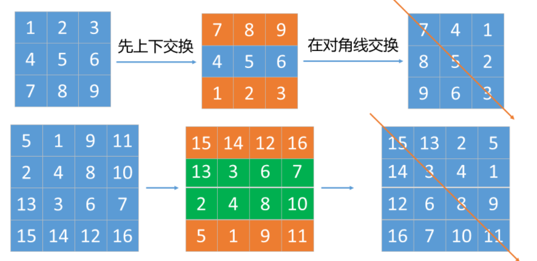

# 力扣初级算法

## 数组

### 旋转图像

[题目](https://leetcode-cn.com/leetbook/read/top-interview-questions-easy/xnhhkv/): 给定一个 *n* × *n* 的二维矩阵 `matrix` 表示一个图像。请你将图像顺时针旋转 90 度。


这个题目的关键是: 旋转操作常用方法是 找到一行中为一组的点，逐层变换位置，找到四个对应的点，确认变换规律。规律为:

```
matrix[i][j] = matrix[len-j-1][i];
matrix[len-j-1][len-i-1] = matrix[len-i-1][len-j-1];
matrix[n][len-j-1] = matrix[j][len-i-1];
matrix[j][len-i-1] = matrix[i][j];
```

找到这样的规律后，再做就不难。


```python
def rotate(self, matrix: List[List[int]]) -> None:
    width = len(matrix)
    k = width // 2
    for i in range(k):
        for j in range(i, width - i -1):
            m = width - i - 1
            n = width - j - 1
            tmp = matrix[i][j]
            matrix[i][j] = matrix[n][i]
            matrix[n][i] = matrix[m][n]
            matrix[m][n] = matrix[j][m]
            matrix[j][m] = tmp
```

如果需要做顺时针旋转 180度、270度，方法也是类似。

对于旋转90度，也可以采用先上线交换，再对角线交换的方法



```python
def rotate(self, matrix: List[List[int]]) -> None:
    """
    更巧的办法，不过不是原地:
    1. 对 行 进行步长-1的分片，上下翻转
    2. 对每行再zip获得每一列，然后把列当成行放回去，完成转置
    """
    matrix[::] = zip(*matrix[::-1])
```
上面的写法等价于
```python
j=0
for i in zip(*matrix[::-1]):
    matrix[j]=i
    j+=1
```

## 设计类

### 打乱数组

[题目](https://leetcode-cn.com/leetbook/read/top-interview-questions-easy/xn6gq1/): 给你一个整数数组 nums ，设计算法来打乱一个没有重复元素的数组。

