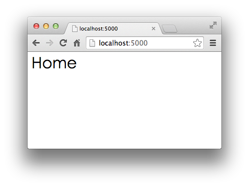
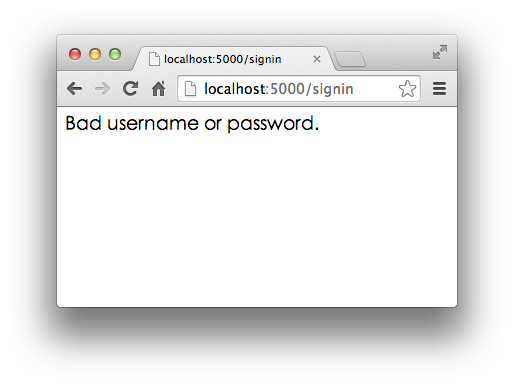
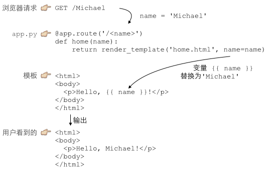

# Flask

## Flask基础

了解了WSGI框架，我们发现：其实一个Web App，就是写一个WSGI的处理函数，针对每个HTTP请求进行响应。

但是如何处理HTTP请求不是问题，问题是如何处理100个不同的URL。

每一个URL可以对应GET和POST请求，当然还有PUT、DELETE等请求，但是我们通常只考虑最常见的GET和POST请求。

一个最简单的想法是从`environ`变量里取出HTTP请求的信息，然后逐个判断：

```
def application(environ, start_response):
    method = environ['REQUEST_METHOD']
    path = environ['PATH_INFO']
    if method=='GET' and path=='/':
        return handle_home(environ, start_response)
    if method=='POST' and path='/signin':
        return handle_signin(environ, start_response)
    ...
```

只是这么写下去代码是肯定没法维护了。

代码这么写没法维护的原因是因为WSGI提供的接口虽然比HTTP接口高级了不少，但和Web App的处理逻辑比，还是比较低级，我们需要在WSGI接口之上能进一步抽象，让我们专注于用一个函数处理一个URL，至于URL到函数的映射，就交给Web框架来做。

由于用Python开发一个Web框架十分容易，所以Python有上百个开源的Web框架。这里我们先不讨论各种Web框架的优缺点，直接选择一个比较流行的Web框架——[Flask](http://flask.pocoo.org/)来使用。

用Flask编写Web App比WSGI接口简单（这不是废话么，要是比WSGI还复杂，用框架干嘛？），我们先用`pip`安装Flask：

```
$ pip install flask
```

然后写一个`app.py`，处理3个URL，分别是：

- `GET /`：首页，返回`Home`；
- `GET /signin`：登录页，显示登录表单；
- `POST /signin`：处理登录表单，显示登录结果。

注意噢，同一个URL`/signin`分别有GET和POST两种请求，映射到两个处理函数中。

Flask通过Python的[装饰器](https://www.liaoxuefeng.com/wiki/1016959663602400/1017451662295584)在内部自动地把URL和函数给关联起来，所以，我们写出来的代码就像这样：

```
from flask import Flask
from flask import request

app = Flask(__name__)

@app.route('/', methods=['GET', 'POST'])
def home():
    return '<h1>Home</h1>'

@app.route('/signin', methods=['GET'])
def signin_form():
    return '''<form action="/signin" method="post">
              <p><input name="username"></p>
              <p><input name="password" type="password"></p>
              <p><button type="submit">Sign In</button></p>
              </form>'''

@app.route('/signin', methods=['POST'])
def signin():
    # 需要从request对象读取表单内容：
    if request.form['username']=='admin' and request.form['password']=='password':
        return '<h3>Hello, admin!</h3>'
    return '<h3>Bad username or password.</h3>'

if __name__ == '__main__':
    app.run()
```

运行`python app.py`，Flask自带的Server在端口`5000`上监听：

```
$ python app.py 
 * Running on http://127.0.0.1:5000/
```

打开浏览器，输入首页地址`http://localhost:5000/`：



首页显示正确！

再在浏览器地址栏输入`http://localhost:5000/signin`，会显示登录表单：


输入预设的用户名`admin`和口令`password`，登录成功：


输入其他错误的用户名和口令，登录失败：



实际的Web App应该拿到用户名和口令后，去数据库查询再比对，来判断用户是否能登录成功。

除了Flask，常见的Python Web框架还有：

- [Django](https://www.djangoproject.com/)：全能型Web框架；
- [web.py](http://webpy.org/)：一个小巧的Web框架；
- [Bottle](http://bottlepy.org/)：和Flask类似的Web框架；
- [Tornado](http://www.tornadoweb.org/)：Facebook的开源异步Web框架。

当然了，因为开发Python的Web框架也不是什么难事，我们后面也会讲到开发Web框架的内容。

### 小结

有了Web框架，我们在编写Web应用时，注意力就从WSGI处理函数转移到URL+对应的处理函数，这样，编写Web App就更加简单了。

在编写URL处理函数时，除了配置URL外，从HTTP请求拿到用户数据也是非常重要的。Web框架都提供了自己的API来实现这些功能。Flask通过`request.form['name']`来获取表单的内容。

## 使用模板

Web框架把我们从WSGI中拯救出来了。现在，我们只需要不断地编写函数，带上URL，就可以继续Web App的开发了。

但是，Web App不仅仅是处理逻辑，展示给用户的页面也非常重要。在函数中返回一个包含HTML的字符串，简单的页面还可以，但是，想想新浪首页的6000多行的HTML，你确信能在Python的字符串中正确地写出来么？反正我是做不到。

俗话说得好，不懂前端的Python工程师不是好的产品经理。有Web开发经验的同学都明白，Web App最复杂的部分就在HTML页面。HTML不仅要正确，还要通过CSS美化，再加上复杂的JavaScript脚本来实现各种交互和动画效果。总之，生成HTML页面的难度很大。

由于在Python代码里拼字符串是不现实的，所以，模板技术出现了。

使用模板，我们需要预先准备一个HTML文档，这个HTML文档不是普通的HTML，而是嵌入了一些变量和指令，然后，根据我们传入的数据，替换后，得到最终的HTML，发送给用户：



这就是传说中的MVC：Model-View-Controller，中文名“模型-视图-控制器”。

Python处理URL的函数就是C：Controller，Controller负责业务逻辑，比如检查用户名是否存在，取出用户信息等等；

包含变量`{{ name }}`的模板就是V：View，View负责显示逻辑，通过简单地替换一些变量，View最终输出的就是用户看到的HTML。

MVC中的Model在哪？Model是用来传给View的，这样View在替换变量的时候，就可以从Model中取出相应的数据。

上面的例子中，Model就是一个`dict`：

```
{ 'name': 'Michael' }
```

只是因为Python支持关键字参数，很多Web框架允许传入关键字参数，然后，在框架内部组装出一个`dict`作为Model。

现在，我们把上次直接输出字符串作为HTML的例子用高端大气上档次的MVC模式改写一下：

```
from flask import Flask, request, render_template

app = Flask(__name__)

@app.route('/', methods=['GET', 'POST'])
def home():
    return render_template('home.html')

@app.route('/signin', methods=['GET'])
def signin_form():
    return render_template('form.html')

@app.route('/signin', methods=['POST'])
def signin():
    username = request.form['username']
    password = request.form['password']
    if username=='admin' and password=='password':
        return render_template('signin-ok.html', username=username)
    return render_template('form.html', message='Bad username or password', username=username)

if __name__ == '__main__':
    app.run()
```

Flask通过`render_template()`函数来实现模板的渲染。和Web框架类似，Python的模板也有很多种。Flask默认支持的模板是[jinja2](http://jinja.pocoo.org/)，所以我们先直接安装jinja2：

```
$ pip install jinja2
```

然后，开始编写jinja2模板：

home.html 用来显示首页的模板：

```
<html>
<head>
  <title>Home</title>
</head>
<body>
  <h1 style="font-style:italic">Home</h1>
</body>
</html>
```

form.html 用来显示登录表单的模板：

```
<html>
<head>
  <title>Please Sign In</title>
</head>
<body>
  
  <p style="color:red">{{ message }}</p>
  
  <form action="/signin" method="post">
    <legend>Please sign in:</legend>
    <p><input name="username" placeholder="Username" value="{{ username }}"></p>
    <p><input name="password" placeholder="Password" type="password"></p>
    <p><button type="submit">Sign In</button></p>
  </form>
</body>
</html>
```

signin-ok.html 登录成功的模板：

```
<html>
<head>
  <title>Welcome, {{ username }}</title>
</head>
<body>
  <p>Welcome, {{ username }}!</p>
</body>
</html>
```

登录失败的模板呢？我们在`form.html`中加了一点条件判断，把`form.html`重用为登录失败的模板。

最后，一定要把模板放到正确的`templates`目录下，`templates`和`app.py`在同级目录下：


启动`python app.py`，看看使用模板的页面效果：


通过MVC，我们在Python代码中处理M：Model和C：Controller，而V：View是通过模板处理的，这样，我们就成功地把Python代码和HTML代码最大限度地分离了。

使用模板的另一大好处是，模板改起来很方便，而且，改完保存后，刷新浏览器就能看到最新的效果，这对于调试HTML、CSS和JavaScript的前端工程师来说实在是太重要了。

在Jinja2模板中，我们用`{{ name }}`表示一个需要替换的变量。很多时候，还需要循环、条件判断等指令语句，在Jinja2中，用``表示指令。

比如循环输出页码：

```

    <a href="/page/{{ i }}">{{ i }}</a>

```

如果`page_list`是一个list：`[1, 2, 3, 4, 5]`，上面的模板将输出5个超链接。

除了Jinja2，常见的模板还有：

- [Mako](http://www.makotemplates.org/)：用`<% ... %>`和`${xxx}`的一个模板；
- [Cheetah](http://www.cheetahtemplate.org/)：也是用`<% ... %>`和`${xxx}`的一个模板；
- [Django](https://www.djangoproject.com/)：Django是一站式框架，内置一个用 \{ % ... %\}和 \{\{ xxx \}\}的模板。

### 小结

有了MVC，我们就分离了Python代码和HTML代码。HTML代码全部放到模板里，写起来更有效率。


# FAQ


## 1. Flask中 template中的html，如何引用static中的css，js?

```
<link rel="stylesheet" href="{{ url_for(‘static’, filename=’css/framework7.ios.css’) }}">

```

参考: https://www.crifan.com/flask_html_template_how_reference_css_js_assets/