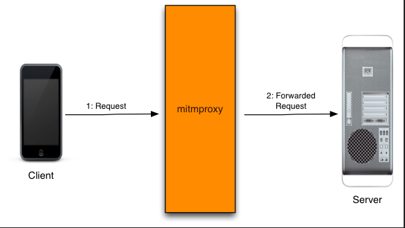

# mitmproxy

## mitmproxy是什么

  


 mitmproxy 是用于 MITM 的 proxy，MITM 即[中间人攻击](https://zh.wikipedia.org/wiki/中间人攻击)（Man-in-the-middle attack）。用于中间人攻击的代理首先会向正常的代理一样转发请求，保障服务端与客户端的通信，其次，会适时的查、记录其截获的数据，或篡改数据，引发服务端或客户端特定的行为。 

mitmproxy 工作在 HTTP 层，当前 HTTPS 的普及让客户端拥有了检测并规避中间人攻击的能力，所以mitmproxy 要正常工作，必须要让客户端（APP 或浏览器）主动信任 mitmproxy 的 SSL 证书，或忽略证书异常。

## 与Fiddler的区别

mitmproxy 可以截获请求帮助开发者查看、分析，更可以通过自定义脚本进行二次开发。

fiddler 无法实现高度定制化的需求类似于：“截获对浏览器对该 url 的请求，将返回内容置空，并将真实的返回内容存到某个数据库，出现异常时发出邮件通知”。

## 适用场景

* web测试

* 仿真爬虫

  利用手机模拟器、无头浏览器来爬取 APP 或网站的数据，mitmpproxy 作为代理可以拦截、存储爬虫获取到的数据，或修改数据调整爬虫的行为。

## 安装

```
pip3 install mitmproxy
```

* 无证书运行chrome

  ```
  "C:\Program Files (x86)\Google\Chrome\Application\chrome.exe" --proxy-server=127.0.0.1:8080 --ignore-certificate-errors
  ```

### 可能出现的问题

*     asyncio.set_event_loop_policy(asyncio.WindowsSelectorEventLoopPolicy())
      AttributeError: module 'asyncio' has no attribute 'WindowsSelectorEventLoopPolicy'

  ```
  pip install mitmproxy==5.0.1 --user
  ```

# 教程

## 入手

### mitmdump 

没有界面，程序默默运行，mitmdump 无法提供过滤请求、查看数据的功能，只能结合自定义脚本，默默工作。 

### mitmweb

 `mitmweb` 命令启动后，会提供一个 web 界面，用户可以实时看到发生的请求，并通过 GUI 交互来过滤请求，查看请求数据。 


### python交互

* py文件，全局定义函数，函数实现了mitmproxy事件

  ```
  import mitmproxy.http
  from mitmproxy import ctx
  num = 0
  def request(flow: mitmproxy.http.HTTPFlow):
      global num
      num = num + 1
      ctx.log.info("We've seen %d flows" % num)
  ```

* py文件，定义变量addons。addons为包含类实例的数组。类中实现相关事件

  ```
  import mitmproxy.http
  from mitmproxy import ctx
  class Counter:
      def __init__(self):
          self.num = 0
  
      def request(self, flow: mitmproxy.http.HTTPFlow):
          self.num = self.num + 1
          ctx.log.info("We've seen %d flows" % self.num)
          
  addons = [
      Counter()
  ]
  ```

  ### 启动

  ```
  mitmweb -s addons.py
  ```

  

## 触发事件

### 针对 HTTP 生命周期

```
def http_connect(self, flow: mitmproxy.http.HTTPFlow):
```

 (Called when) 收到了来自客户端的 HTTP CONNECT 请求。在 flow 上设置非 2xx 响应将返回该响应并断开连接。

CONNECT 不是常用的 HTTP 请求方法，目的是与服务器建立代理连接，仅是 client 与 proxy 的之间的交流，

CONNECT 请求不会触发 request、response 等其他常规的 HTTP 事件。 

```
def requestheaders(self, flow: mitmproxy.http.HTTPFlow):
```

 (Called when) 来自客户端的 HTTP 请求的头部被成功读取。此时 flow 中的 request 的 body 是空的。 

```
def request(self, flow: mitmproxy.http.HTTPFlow):
```

 (Called when) 来自客户端的 HTTP 请求被成功完整读取。 

```
def responseheaders(self, flow: mitmproxy.http.HTTPFlow):
```

 (Called when) 来自服务端的 HTTP 响应的头部被成功读取。此时 flow 中的 response 的 body 是空的。 

```
def response(self, flow: mitmproxy.http.HTTPFlow):
```

 (Called when) 来自服务端端的 HTTP 响应被成功完整读取。 

```
def error(self, flow: mitmproxy.http.HTTPFlow):
```

 (Called when) 发生了一个 HTTP 错误。比如无效的服务端响应、连接断开等。注意与“有效的 HTTP 错误返回”不是一回事，后者是一个正确的服务端响应，只是 HTTP code 表示错误而已。 

### 针对 TCP 生命周期

```
def tcp_start(self, flow: mitmproxy.tcp.TCPFlow):
```

(Called when) 建立了一个 TCP 连接。

```
def tcp_message(self, flow: mitmproxy.tcp.TCPFlow):
```

(Called when) TCP 连接收到了一条消息，最近一条消息存于 flow.messages[-1]。消息是可修改的。

```
def tcp_error(self, flow: mitmproxy.tcp.TCPFlow):
```

(Called when) 发生了 TCP 错误。

```
def tcp_end(self, flow: mitmproxy.tcp.TCPFlow):
```

(Called when) TCP 连接关闭。

### 针对 Websocket 生命周期

```
def websocket_handshake(self, flow: mitmproxy.http.HTTPFlow):
```

(Called when) 客户端试图建立一个 websocket 连接。可以通过控制 HTTP 头部中针对 websocket 的条目来改变握手行为。flow 的 request 属性保证是非空的的。

```
def websocket_start(self, flow: mitmproxy.websocket.WebSocketFlow):
```

 

(Called when) 建立了一个 websocket 连接。

```
def websocket_message(self, flow: mitmproxy.websocket.WebSocketFlow):
```

(Called when) 收到一条来自客户端或服务端的 websocket 消息。最近一条消息存于 flow.messages[-1]。消息是可修改的。目前有两种消息类型，对应 BINARY 类型的 frame 或 TEXT 类型的 frame。

```
def websocket_error(self, flow: mitmproxy.websocket.WebSocketFlow):
```

(Called when) 发生了 websocket 错误。

```
def websocket_end(self, flow: mitmproxy.websocket.WebSocketFlow):
```

(Called when) websocket 连接关闭。

### 针对网络连接生命周期

```
def clientconnect(self, layer: mitmproxy.proxy.protocol.Layer):
```

(Called when) 客户端连接到了 mitmproxy。注意一条连接可能对应多个 HTTP 请求。

```
def clientdisconnect(self, layer: mitmproxy.proxy.protocol.Layer):
```

(Called when) 客户端断开了和 mitmproxy 的连接。

```
def serverconnect(self, conn: mitmproxy.connections.ServerConnection):
```

(Called when) mitmproxy 连接到了服务端。注意一条连接可能对应多个 HTTP 请求。

```
def serverdisconnect(self, conn: mitmproxy.connections.ServerConnection):
```

(Called when) mitmproxy 断开了和服务端的连接。

```
def next_layer(self, layer: mitmproxy.proxy.protocol.Layer):
```

(Called when) 网络 layer 发生切换。你可以通过返回一个新的 layer 对象来改变将被使用的 layer。

### 通用生命周期

```
def configure(self, updated: typing.Set[str]):
```

(Called when) 配置发生变化。updated 参数是一个类似集合的对象，包含了所有变化了的选项。在 mitmproxy 启动时，该事件也会触发，且 updated 包含所有选项。

```
def done(self):
```

(Called when) addon 关闭或被移除，又或者 mitmproxy 本身关闭。由于会先等事件循环终止后再触发该事件，所以这是一个 addon 可以看见的最后一个事件。由于此时 log 也已经关闭，所以此时调用 log 函数没有任何输出。

```
def load(self, entry: mitmproxy.addonmanager.Loader):
```

(Called when) addon 第一次加载时。entry 参数是一个 Loader 对象，包含有添加选项、命令的方法。这里是 addon 配置它自己的地方。

```
def log(self, entry: mitmproxy.log.LogEntry):
```

(Called when) 通过 mitmproxy.ctx.log 产生了一条新日志。小心不要在这个事件内打日志，否则会造成死循环。

```
def running(self):
```

(Called when) mitmproxy 完全启动并开始运行。此时，mitmproxy 已经绑定了端口，所有的 addon 都被加载了。

```
def update(self, flows: typing.Sequence[mitmproxy.flow.Flow]):
```

(Called when) 一个或多个 flow 对象被修改了，通常是来自一个不同的 addon。

## 案例

### 需求

* 因为百度搜索是不靠谱的，所有当客户端发起百度搜索时，记录下用户的搜索词，再修改请求，将搜索词改为“360 搜索”；

  ```
  def request(self, flow: mitmproxy.http.HTTPFlow):
      # 忽略非百度搜索地址
      if flow.request.host != "www.baidu.com" or not flow.request.path.startswith("/s"):
          return
  
      # 确认请求参数中有搜索词
      if "wd" not in flow.request.query.keys():
          ctx.log.warn("can not get search word from %s" % flow.request.pretty_url)
          return
  
      # 输出原始的搜索词
      ctx.log.info("catch search word: %s" % flow.request.query.get("wd"))
      # 替换搜索词为“360搜索”
      flow.request.query.set_all("wd", ["360搜索"])
  ```

* 因为 360 搜索还是不靠谱的，所有当客户端访问 360 搜索时，将页面中所有“搜索”字样改为“请使用谷歌”。

  ```
  def response(self, flow: mitmproxy.http.HTTPFlow):
      # 忽略非 360 搜索地址
      if flow.request.host != "www.so.com":
          return
  
      # 将响应中所有“搜索”替换为“请使用谷歌”
      text = flow.response.get_text()
      text = text.replace("搜索", "请使用谷歌")
      flow.response.set_text(text)
  ```

* 因为谷歌是个不存在的网站，所有就不要浪费时间去尝试连接服务端了，所有当发现客户端试图访问谷歌时，直接断开连接。

```
def http_connect(self, flow: mitmproxy.http.HTTPFlow):
    # 确认客户端是想访问 www.google.com
    if flow.request.host == "www.google.com":
        # 返回一个非 2xx 响应断开连接
        flow.response = http.HTTPResponse.make(404)
```

### 源代码

*   `joker.py` 

  ```
  import mitmproxy.http
  from mitmproxy import ctx, http
  
  class Joker:
      def request(self, flow: mitmproxy.http.HTTPFlow):
          if flow.request.host != "www.baidu.com" or not flow.request.path.startswith("/s"):
              return
  
          if "wd" not in flow.request.query.keys():
              ctx.log.warn("can not get search word from %s" % flow.request.pretty_url)
              return
  
          ctx.log.info("catch search word: %s" % flow.request.query.get("wd"))
          flow.request.query.set_all("wd", ["360搜索"])
  
      def response(self, flow: mitmproxy.http.HTTPFlow):
          if flow.request.host != "www.so.com":
              return
  
          text = flow.response.get_text()
          text = text.replace("搜索", "请使用谷歌")
          flow.response.set_text(text)
  
      def http_connect(self, flow: mitmproxy.http.HTTPFlow):
          if flow.request.host == "www.google.com":
              flow.response = http.HTTPResponse.make(404)
  ```

*  addons.py 

  ```
  import joker
  
  addons = [
      joker.Joker(),
  ]
  ```

* 运行

  addons.py和joker.py放置在同一文件夹

  ```
  mitmweb -s addons.py
  ```

### 结果


