# Wireshark

## Wireshark是什么

Wireshark是一个网络数据包分析软件。 使用WinPCAP作为接口，直接与网卡进行数据报文交换。网络管理员用它来检测网络问题；网络安全工程师用它来检查安全相关；开发者用它来为新的通信协义排错；普通使用者用它来学习网络协议的知识；“居心叵测”的人用它来寻找一些敏感信息...相对于TCPdump来说，Wireshark更友好，功能更强大。

## 基本原理

### 抓包适用网络

 1）本机环境-直接抓本机网卡进出的流量：直接在终端安装ws，然后ws抓本机网卡的与互联网通信的流量。

  

 2）集线器环境（老网络）-集线器：向其他所有端口都会泛洪，抓整个局域网里面的包

集线器-（hub）（多端口的信号放大设备）属于纯硬件网络底层设备，基本上不具有类似于交换机的"智能记忆"能力和"学习"能力。它也不具备交换机所具有的MAC地址表，所以它发送数据时都是没有针对性的，而是采用广播方式发送。也就是说当它要向某节点发送数据时，不是直接把数据发送到目的节点，而是把数据包发送到与集线器相连的所有节点。    

  

3）交换机环境： 

* 端口镜像（安全）：SPAN技术，复制其他端口的数据包到特定端口。

  

* ARP欺骗（攻击）：需安装arp欺骗软件，错位欺骗，如图，PC1会不断发送欺骗,毒化PC2的arp表，会产生错的绑定，交换机根据mac表就会把数据包乖乖丢给PC1。

  

* MAC泛洪：泛洪大量垃圾包，产生大量的mac地址，改变了交换机原有的mac地址表，如图，这样流量就泛洪给F1了。                           


   

### 底层原理

wireshark的总体结构如下图：


* 功能模块

| **模块名**                                   | **功能**                                                |
| -------------------------------------------- | ------------------------------------------------------- |
| GTK/Qt                                       | 处理所有的用户输入/输出(所有的窗口,对话框等等)          |
| Core                                         | 主要的"粘合代码"(glue code),它把其他的块组合到一起      |
| Epan(Ethereal Packet Analyzer)               | 协议树(Protocol-Tree) - 保存捕获文件的协议信息数据      |
| 解析器(Dissectors) - 多种协议的解析器        | /epan/dissectors                                        |
| 插件(Plugins) - 一些用插件实现的协议解析器   | /plugins                                                |
| 显示过滤器(Display-Filters) - 显示过滤器引擎 | /epan/dfilter                                           |
| Wiretap                                      | wiretap库用于读/写libpcap格式或者其他文件格式的捕获文件 |
| Capture                                      | 抓包引擎相关接口                                        |
| Dumpcap                                      | 抓包引擎. 这是唯一需要提升权限来执行的部                |

## 相关网址

* 下载地址  https://www.wireshark.org/download.html 

* win10pcap兼容包 (问题：选择抓包，不显示网卡得情况)  http://www.win10pcap.org/download/ 

# 教程实例

## 主界面

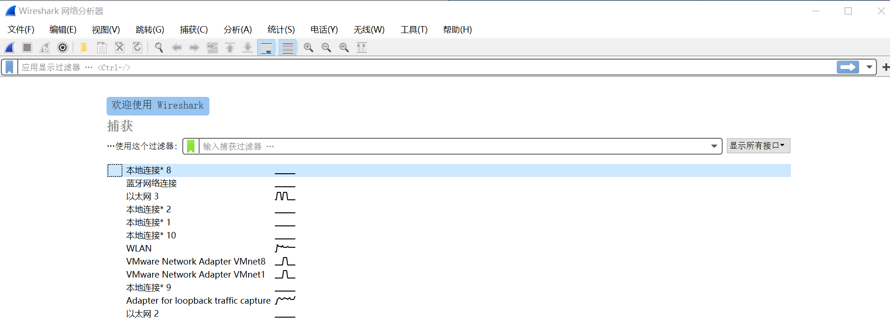

 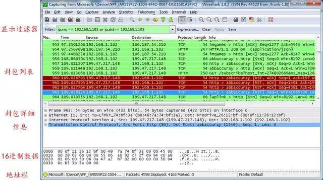 

## 选择WLAN网卡


## 测试百度网址

* ping www.baidu.com


* 输入过滤器


* 设置过滤器选择对应ip和icmp

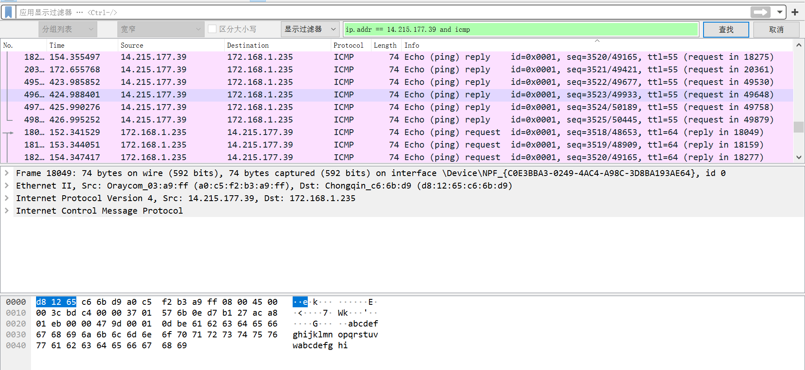

* 查看icmp包结构


* 标题介绍


```
No : 编号

Time：时间戳

Source:	源地址

Destination:	目标地址

Protocol:	协议

Length:	长度

Info：数据包信息
```

## 过滤器规则

### 语法和实例

抓包过滤器类型Type（host、net、port）、方向Dir（src、dst）、协议Proto（ether、ip、tcp、udp、http、icmp、ftp等）、逻辑运算符（&& 与、|| 或、！非）

* 协议过滤

   TCP，只显示TCP协议的数据包列表

   HTTP，只查看HTTP协议的数据包列表

   ICMP，只显示ICMP协议的数据包列表

* IP过滤

   host 192.168.1.104

   src host 192.168.1.104

   dst host 192.168.1.104

* 端口过滤

   port 80

   src port 80

   dst port 80

* 逻辑运算符&& 与、|| 或、！非

   src host 192.168.1.104 && dst port 80 抓取主机地址为192.168.1.80、目的端口为80的数据包

   host 192.168.1.104 || host 192.168.1.102 抓取主机为192.168.1.104或者192.168.1.102的数据包

   ！broadcast 不抓取广播数据包

### 过滤器语法和实例

* 比较操作符

 比较操作符有== 等于、！= 不等于、> 大于、< 小于、>= 大于等于、<=小于等于。

* 协议过滤

  直接在Filter框中直接输入协议名即可。注意：协议名称需要输入小写。

   tcp，只显示TCP协议的数据包列表

   http，只查看HTTP协议的数据包列表

   icmp，只显示ICMP协议的数据包列表

* ip过滤

    ip.src ==192.168.1.104 显示源地址为192.168.1.104的数据包列表

    ip.dst==192.168.1.104, 显示目标地址为192.168.1.104的数据包列表

    ip.addr == 192.168.1.104 显示源IP地址或目标IP地址为192.168.1.104的数据包列表


* 端口过滤

   tcp.port ==80, 显示源主机或者目的主机端口为80的数据包列表。

   tcp.srcport == 80, 只显示TCP协议的源主机端口为80的数据包列表。

   tcp.dstport == 80，只显示TCP协议的目的主机端口为80的数据包列表。


*  Http模式过滤

 http.request.method=="GET",  只显示HTTP GET方法的。

* 逻辑运算符为 and/or/not

 过滤多个条件组合时，使用and/or。比如获取IP地址为192.168.1.104的ICMP数据包表达式为ip.addr == 192.168.1.104 and icmp


* 按照数据包内容过滤。假设我要以IMCP层中的内容进行过滤，可以单击选中界面中的码流，在下方进行选中数据。如下


右键单击选中后出现如下界面

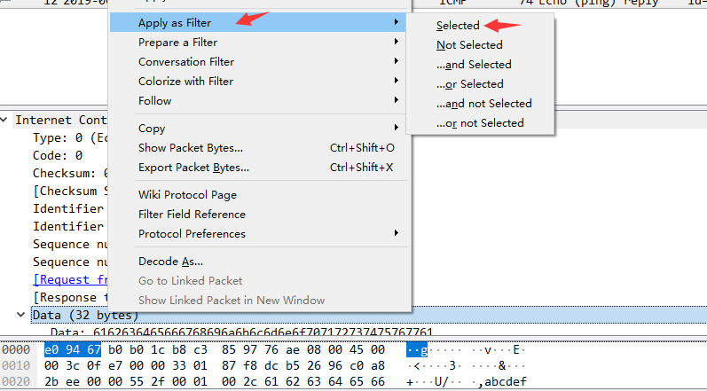

选中Select后在过滤器中显示如下


后面条件表达式就需要自己填写。如下我想过滤出data数据包中包含"abcd"内容的数据流。**包含的关键词是contains 后面跟上内容。**


# 实例分析

## TCP三次握手

（1）TCP三次握手连接建立过程

  Step1：客户端发送一个SYN=1，ACK=0标志的数据包给服务端，请求进行连接，这是第一次握手；

  Step2：服务端收到请求并且允许连接的话，就会发送一个SYN=1，ACK=1标志的数据包给发送端，告诉它，可以通讯了，并且让客户端发送一个确认数据包，这是第二次握手；

  Step3：服务端发送一个SYN=0，ACK=1的数据包给客户端端，告诉它连接已被确认，这就是第三次握手。TCP连接建立，开始通讯。

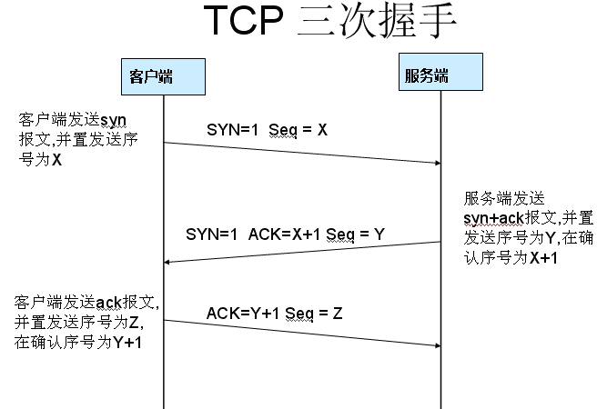

（2）wireshark抓包获取访问指定服务端数据包

  Step1：启动wireshark抓包，打开浏览器输入www.huawei.com。

  Step2：使用ping www.huawei.com获取IP。


  Step3：输入过滤条件获取待分析数据包列表 ip.addr == 211.162.2.183


 图中可以看到wireshark截获到了三次握手的三个数据包。第四个包才是HTTP的， 这说明HTTP的确是使用TCP建立连接的。

**第一次握手数据包**

客户端发送一个TCP，标志位为SYN，序列号为0， 代表客户端请求建立连接。 如下图。


数据包的关键属性如下：

 SYN ：标志位，表示请求建立连接

 Seq = 0 ：初始建立连接值为0，数据包的相对序列号从0开始，表示当前还没有发送数据

 Ack =0：初始建立连接值为0，已经收到包的数量，表示当前没有接收到数据

**第二次握手的数据包**

服务器发回确认包, 标志位为 SYN,ACK. 将确认序号(Acknowledgement Number)设置为客户的I S N加1以.即0+1=1, 如下图


 数据包的关键属性如下：

[SYN + ACK]: 标志位，同意建立连接，并回送SYN+ACK

 Seq = 0 ：初始建立值为0，表示当前还没有发送数据

 Ack = 1：表示当前端成功接收的数据位数，虽然客户端没有发送任何有效数据，确认号还是被加1，因为包含SYN或FIN标志位。（并不会对有效数据的计数产生影响，因为含有SYN或FIN标志位的包并不携带有效数据）

**第三次握手的数据包**

 客户端再次发送确认包(ACK) SYN标志位为0,ACK标志位为1.并且把服务器发来ACK的序号字段+1,放在确定字段中发送给对方.并且在数据段放写ISN的+1, 如下图:

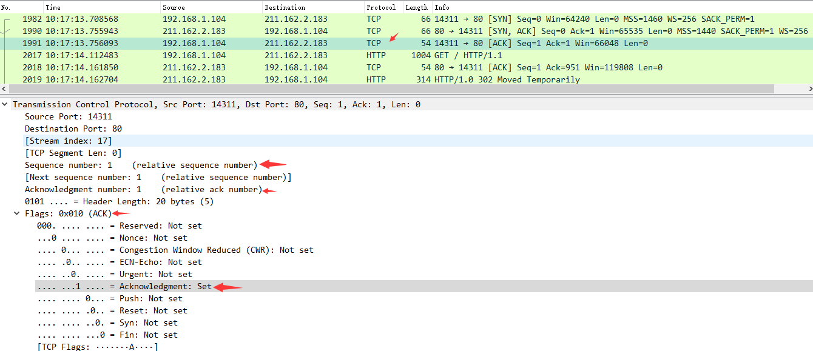

数据包的关键属性如下：

 ACK ：标志位，表示已经收到记录

 Seq = 1 ：表示当前已经发送1个数据

 Ack = 1 : 表示当前端成功接收的数据位数，虽然服务端没有发送任何有效数据，确认号还是被加1，因为包含SYN或FIN标志位（并不会对有效数据的计数产生影响，因为含有SYN或FIN标志位的包并不携带有效数据)。

 就这样通过了TCP三次握手，建立了连接。开始进行数据交互


下面针对数据交互过程的数据包进行一些说明：

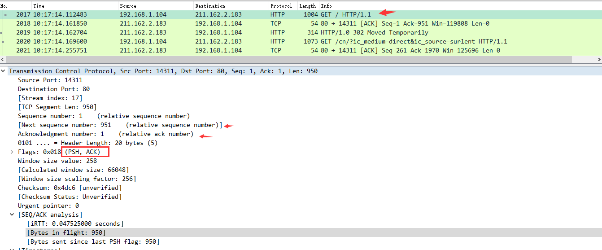

数据包的关键属性说明

 Seq: 1

 Ack: 1: 说明现在共收到1字节数据

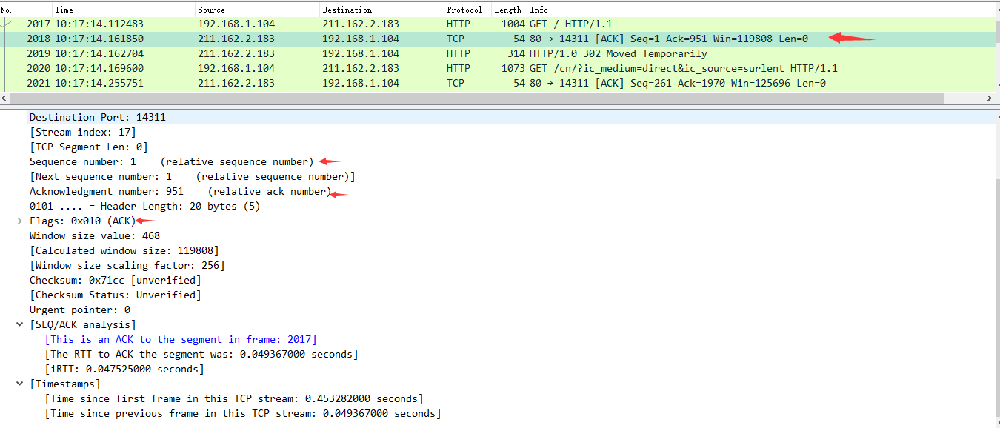

 Seq: 1
 Ack: 951: 说明现在服务端共收到951字节数据

 在TCP层，有个FLAGS字段，这个字段有以下几个标识：SYN, FIN, ACK, PSH, RST, URG。如下

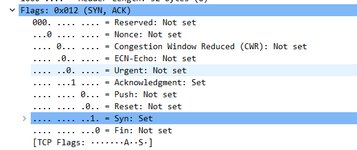

  其中，对于我们日常的分析有用的就是前面的五个字段。它们的含义是：SYN表示建立连接，FIN表示关闭连接，ACK表示响应，PSH表示有DATA数据传输，RST表示连接重置。

## 四次挥手

四次挥手

假设Client端发起中断连接请求，也就是发送FIN报文。

Server端接到FIN报文后，意思是说"我Client端没有数据要发给你了"，但是如果你还有数据没有发送完成，则不必急着关闭Socket，可以继续发送数据。所以你先发送ACK，“告诉Client端，你的请求我收到了，但是我还没准备好，请继续你等我的消息”。这个时候Client端就进入FIN_WAIT状态，继续等待Server端的FIN报文。

当Server端确定数据已发送完成，则向Client端发送FIN报文，“告诉Client端，好了，我这边数据发完了，准备好关闭连接了”。

Client端收到FIN报文后，"就知道可以关闭连接了，但是他还是不相信网络，怕Server端不知道要关闭，所以发送ACK后进入TIME_WAIT状态，如果Server端没有收到ACK则可以重传。“，Server端收到ACK后，“就知道可以断开连接了”。Client端等待了2MSL后依然没有收到回复，则证明Server端已正常关闭，那好，我Client端也可以关闭连接了。Ok，TCP连接就这样关闭了！


四次数据包


## tcp/ip数据包分析
标志位对应的功能：

```
URG： 紧急指针（ urgent pointer）有效。
ACK： 确认序号有效。
PSH： 接收方应该尽快将这个报文段交给应用层。
RST： 重建连接。
SYN： 同步序号用来发起一个连接。
FIN： 发端完成发送任务。
窗口大小：用于流量控制。
检验和：检验和覆盖了整个的 TCP报文段： TCP首部和TCP数据，与udp相似需要计算伪首部。
tcp数据包结构及在wireshark中的位置
```

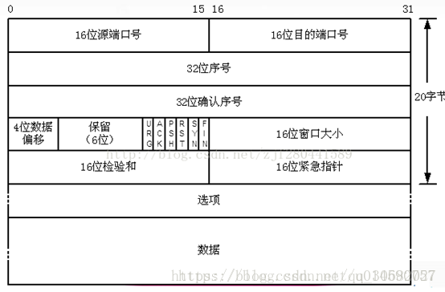

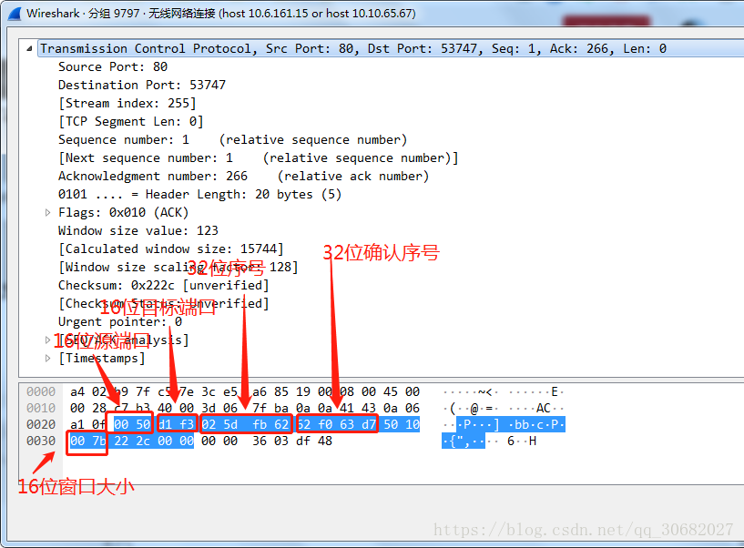

ip数据包

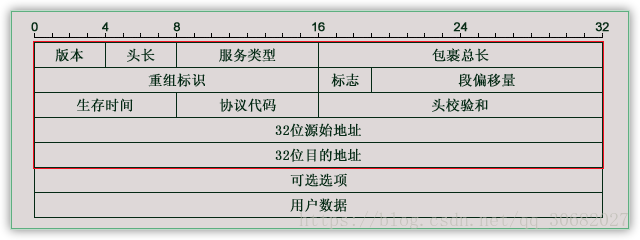

