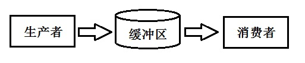

# 数据结构

## 队列和栈

python中对于栈和队列的问题，一般可以用 list 和 dequere 来模拟。

list的操作如下

```Python
roommate = ['suhong','ziheng','siyuan'] #创建list
len(roommate) #获取list中元素个数
print(roommate[2]) #取list中元素
print(roommate[-1]) #取list中元素
roommate.append('xinran') #追加元素
roommate.insert(1,'panpan') #指定位置添加元素
roommate.pop() #删除末尾元素
roommate.pop(i) #删除索引i处的元素

roommate.sort() # 对list进行排序,list元素本身顺序发生改变，无返回值
r2=sorted(roommate,reverse=True)  # 对list进行排序,list本身顺序无改变，返回一个新的list
```

为了提高效率还可以使用 dequeue。deque是为了高效实现插入和删除操作的双向列表，适合用于队列和栈：

```python
from collections import deque
q = deque(['a', 'b', 'c'])
q.append('x')
q.appendleft('y')
print(q)
a1 = q.pop()
print(a1)
a2 = q.popleft()
print(a2)
q
```

`deque` 除了实现list的 `append()` 和 `pop()` 外，还支持 `appendleft()` 和 `popleft()` ，这样就可以非常高效地往头部添加或删除元素。deque 除了从 `collections` 导入，也可以从 `queue` 模块导入。

### 队列

#### 常用队列

Python的Queue模块中提供了同步的、线程安全的队列类，包括FIFO（先入先出)队列Queue，LIFO（后入先出）队列LifoQueue，和优先级队列PriorityQueue。这些队列都实现了锁原语，能够在多线程中直接使用。可以使用队列来实现线程间的同步。

常用方法：

* Queue.qsize() 返回队列的大小
* Queue.empty() 如果队列为空，返回True,反之False
* Queue.full() 如果队列满了，返回True,反之False，Queue.full 与 maxsize 大小对应
* Queue.get([block[, timeout]])获取队列，timeout等待时间
* Queue.get_nowait() 相当于Queue.get(False)，非阻塞方法
* Queue.put(item) 写入队列，timeout等待时间
* Queue.task_done() 在完成一项工作之后，Queue.task_done()函数向任务已经完成的队列发送一个信号。每个get()调用得到一个任务，接下来task_done()调用告诉队列该任务已经处理完毕。
* Queue.join() 实际上意味着等到队列为空，再执行别的操作

```python
from queue import Queue,LifoQueue,PriorityQueue
#先进先出队列
q=Queue(maxsize=5)
#后进先出队列
lq=LifoQueue(maxsize=6)
#优先级队列
pq=PriorityQueue(maxsize=5)
 
for i in range(5):
    q.put(i)
    lq.put(i)
    pq.put(i)
    
print("先进先出队列：%s;是否为空：%s；多大,%s;是否满,%s" %(q.queue,q.empty(),q.qsize(),q.full()))
print("后进先出队列：%s;是否为空：%s;多大,%s;是否满,%s" %(lq.queue,lq.empty(),lq.qsize(),lq.full()))
print("优先级队列：%s;是否为空：%s,多大,%s;是否满,%s" %(pq.queue,pq.empty(),pq.qsize(),pq.full()))
 
print(q.get(),lq.get(),pq.get())
 
print("先进先出队列：%s;是否为空：%s；多大,%s;是否满,%s" %(q.queue,q.empty(),q.qsize(),q.full()))
print("后进先出队列：%s;是否为空：%s;多大,%s;是否满,%s" %(lq.queue,lq.empty(),lq.qsize(),lq.full()))
print("优先级队列：%s;是否为空：%s,多大,%s;是否满,%s" %(pq.queue,pq.empty(),pq.qsize(),pq.full()))
```
结果为
```
先进先出队列：deque([0, 1, 2, 3, 4]);是否为空：False；多大,5;是否满,True
后进先出队列：[0, 1, 2, 3, 4];是否为空：False;多大,5;是否满,False
优先级队列：[0, 1, 2, 3, 4];是否为空：False,多大,5;是否满,True
0 4 0
先进先出队列：deque([1, 2, 3, 4]);是否为空：False；多大,4;是否满,False
后进先出队列：[0, 1, 2, 3];是否为空：False;多大,4;是否满,False
优先级队列：[1, 3, 2, 4];是否为空：False,多大,4;是否满,False
```

#### 生产者消费者模式

生产者消费者模式并不是GOF提出的众多模式之一，但它依然是开发同学编程过程中最常用的一种模式



生产者模块儿负责产生数据，放入缓冲区，这些数据由另一个消费者模块儿来从缓冲区取出并进行消费者相应的处理。该模式的优点在于：

* 解耦：缓冲区的存在可以让生产者和消费者降低互相之间的依赖性，一个模块儿代码变化，不会直接影响另一个模块儿
* 并发：由于缓冲区，生产者和消费者不是直接调用，而是两个独立的并发主体，生产者产生数据之后把它放入缓冲区，就继续生产数据，不依赖消费者的处理速度

在Python中，队列是最常用的线程间的通信方法，因为它是线程安全的，自带锁。而Condition等需要额外加锁的代码操作，在编程对死锁现象要很小心，Queue就不用担心这个问题。

```python
from queue import Queue
import time, threading
q = Queue(maxsize=0)

def product(name):
    count = 1
    while True:
        q.put('气球兵{}'.format(count))
        print('{}训练气球兵{}只'.format(name, count))
        count += 1
        time.sleep(5)

def consume(name):
    while True:
        print('{}使用了{}'.format(name, q.get()))
        time.sleep(1)
        q.task_done()

t1 = threading.Thread(target=product, args=('wpp',))
t2 = threading.Thread(target=consume, args=('ypp',))
t3 = threading.Thread(target=consume, args=('others',))

t1.start()
t2.start()
t3.start()
```
### 栈

## 参考

1. [Python 队列（Queue）用法](https://blog.csdn.net/weixin_43533825/article/details/89155648)
2. [python中用list实现queue](https://blog.csdn.net/weixin_44311188/article/details/85767425)
3. [Python 通过List 实现队列的操作](https://blog.csdn.net/weixin_41754309/article/details/108665964)
4. [Python之队列queue模块使用 常见问题与用法](https://www.cnblogs.com/wt11/p/5952500.html)