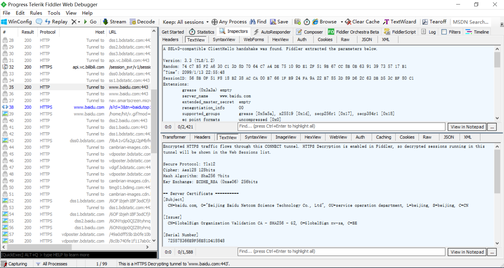
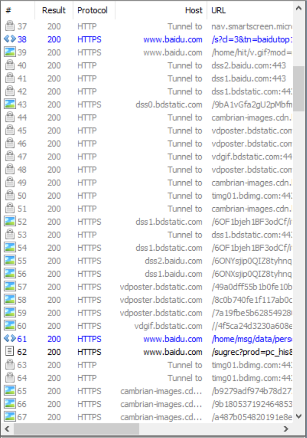
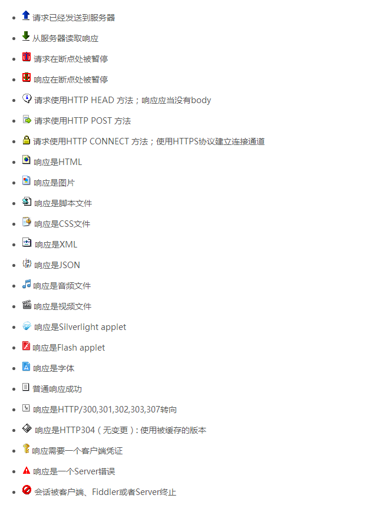

# Fiddler

## 概述

### Fiddler是什么

Fiddler（中文名称：小提琴）是一个HTTP的调试代理，以代理服务器的方式，监听系统的Http网络数据流动，Fiddler可以也可以让你检查所有的HTTP通讯，设置断点，以及Fiddle所有的“进出”的数据（我一般用来抓包）,Fiddler还包含一个简单却功能强大的基于JScript .NET事件脚本子系统，它可以支持众多的HTTP调试任务。

### 基本原理 

Fiddler是以代理WEB服务器的形式工作的,浏览器与服务器之间通过建立TCP连接以HTTP协议进行通信，浏览器默认通过自己发送HTTP请求到服务器，它使用代理地址:127.0.0.1, 端口:8888. 当Fiddler开启会自动设置代理， 退出的时候它会自动注销代理，这样就不会影响别的程序。不过如果Fiddler非正常退出，这时候因为Fiddler没有自动注销，会造成网页无法访问。解决的办法是重新启动下Fiddler。

### 应用场景

* 开发环境的host配置； 
* 前后端接口连调——Composer 
* 定位线上bug——将发布文件代理到本地，快速定位线上bug
* 性能分析和优化——Inspectors 、Timeline 

### 相关网址

* 官方网站（ http://www.telerik.com/fiddler ）
* 官方文档（ https://docs.telerik.com/ ）

# 使用介绍

## 界面

## 会话界面

### 会话图标解释

## 监控界面

### 标题头

**响应结果显示区**

| Transformer：　　　　     　　　  响应信息的压缩编码格式，对响应信息进行编码、解码、转码操作。 |      |
| ------------------------------------------------------------ | ---- |
| Headers：　　　  　　　　　　　　   响应信息，包含响应状态、响应头、响应体。 |      |
| textView：　　　　　　　　　　　　　以文本的形式展示响应结果。 |      |
| SyntaxView：　　　　　　　　　　　 以脚本的形式展示响应结果（需要安装插件）。 |      |
| ImageView： 　　　　　　　　　　   当响应中包含图片时可以用此功能进行查看图片以及图片信息。 |      |
| HexView：　　　　　　　　　　　　  以16进制展示响应结果。    |      |
| WebView：　　　　　　　　　　　　 以列表形式展示响应结果。   |      |
| Auth：　　　　　　　　　　　　　　  展示响应结果中部分信息。 |      |
| Caching：　　　　　　　　　　　　   响应的缓存过期时间或者缓存 |      |
| Cookies：　　　　　　　　　　　　　 展示响应中的cookies信息。 |      |
| Raw：　　　　　　　　　　　　　　　以纯文本形式展示响应头。  |      |
| json：　　　　　　　　　　　　　　　以JSON形式展示响应结果。 |      |
| XML：　　　　　　　　　　　　　　  以XML形式展示响应结果。   |      |

## 设置过滤

* 设置fiddler过滤请求

## 修改抓包内容

### 拦截数据

* 拦截请求：

1、F11先开始拦截，然后在发送请求

2、修改拦截下来的请求，修改数据

3、shift+F11关闭拦截

4、run to complete，把所有拦截下来的请求发送过去

* 拦截响应：

1、alt+F11开始拦截

2、修改数据

3、shift+F11关闭拦截

4、run to complete，把修改的请求发送过去

* fiddler可以拦截请求或者响应进行测试

* 复现上边的问题就可以在响应返回前再次提交，可测试连续提交出现重复数据的问题。

* 修改请求参数，测试后台稳定性。在红色框内任意修改请求参数

* 修改响应，查看前端的容错性，有没有不友好的错误显示。

 

# 手机抓包

fiddler没有手机客户端，都是安装在PC上，要实现对手机上的程序抓包，则需要对PC上的fiddler和手机端做一些配置。

## PC端fiddler配置

### 1. 安装HTTPS证书

手机上的应用很多涉及到个人信息，采用比较安全的HTTPS加密过，而fiddler默认只捕获http会话而不抓取HTTPS报文，导致打开fiddler后就打不开https网页（比如百度），解决办法：**打开Fiddler->Tool->Fiddler Options->HTTPS tab，勾选上并Capture HTTPS CONNECTs（捕获 HTTPS 连接）和 Decrypt HTTPS traffic （HTTPS 请求解密），并安装证书（首次使用无证书，会弹出是否信任fiddler证书和安全提示，直接点击yes就行），重启Fiddler生效。**

### 2. 允许手机远程连接

如果想要捕获手机上的通信数据，就需要手机连接上Fiddler代理，而Fiddler默认是不允许其他设备进行连接的，解决办法：**点击 Fiddler->Tools -> Options，在 Connections 面板选中 Allow remote computers to connect 允许其他设备连接（此操作需重启Fiddler生效）。**

### 3. 查看IP地址

- 电脑ip地址可通过cmd命令行输入ipconfig查询，或网络连接信息中找到

  如下图我的IP是172.168.1.235。

  

## 手机端配置

需要在移动终端（手机或pad）上指定代理服务器为Fiddler所在主机IP（需要处于同一网络），端口默认8888。

### 1. 接入网络

要保证手机和安装有fiddler的电脑处在同一局域网内，手机能ping通电脑。方法：**家用或办公环境把PC和手机WLAN连接上同一个路由器的无线SSID获取到同一网段内的IP地址即可。台式机要插入无线网卡才能连WiFi，最好用笔记本电脑和手机连同一WiFi很方便。**如下图，我的手机IP是192.168.1.104，与电脑192.168.1.106可互通，就能访问192.168.1.106:8888。

### 2. 手机安装根证书

在手机上需要安装Fiddler根证书，因为Fiddler是通过自己生成的证书对网络请求重新签名进行https会话解密的，如果不安装证书的话只能抓取HTTP请求。

（1）手机和电脑连接同一个网络，打开手机浏览器，输入Fiddler Server地址[http://ipv4.fiddler:8888/](https://link.jianshu.com?t=http%3A%2F%2Fipv4.fiddler%3A8888%2F)（因为fiddler装在PC上，所以Fiddler Server地址就是PC的IP地址，带上端口号8888，我的是http://192.168.1.106:8888/）， 跳转到 Fiddler Echo Service 证书下载页，点击FiddlerRoot certificate下载并安装；

（2） 为证书命名后点击确定；

（3）要求设置一个手机密码，自己设置一个，记住密码就行，最后不用了去系统-安全-密码中去掉即可；

设置密码

### 3. 手机代理设置

更改手机无线网的代理方法：**打开系统设置-WLAN，长按WiFi接入的SSID修改网络，点击高级选项，代理选择手动，主机名输入fiddler的电脑ip地址192.168.1.106，端口号输入8888，保存即可。**

## 抓包

PC上和手机上的配置完成后就可以操作手机，在电脑上用fiddler抓包了，比如访问一些网站和APP，fiddler中就会显示捕获到的手机上HTTP/HTTPS通讯记录，抓包成功。

## 还原手机状态

抓包结束后，需要手动还原手机状态，方法如下（不同机型可能有些微差别）：
 （1） 停止电脑对手机的网络监控：系统设置-WLAN，长按wifi修改网络，高级选项找到代理，去掉手动代理即可；
 （2）删除手机中证书：安卓系统设置 系统 设备安全 受信任的凭据  用户 ，点击证书删除即可；
 （3） 删除手机上密码：手机系统—安全—密码，删除系统密码即可。